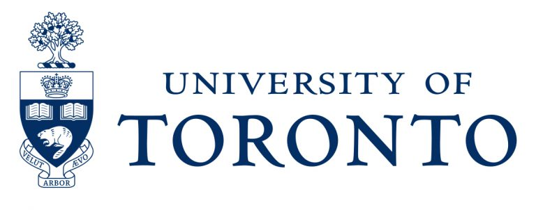

```{=html}
<style>
  /* suppress the Quarto-generated title block on this page */
  #title-block-header { display: none; }
</style>

<div class="uoft-header">
  <div class="uoft-heading-block">
    <div class="uoft-course-code">CSC413 / CSC2516</div>
    <div class="uoft-title">Neural Networks and Deep Learning</div>
  </div>
  
</div>
<div class="uoft-title-block">
  <div class="uoft-subtitle">University of Toronto — Fall 2026</div>
  <div class="uoft-course-people">
    <span><strong>Instructor:</strong> Colin Raffel</span>
    <span><strong>Prep TA:</strong> Malikeh Ehghaghi</span>
  </div>
</div>
```

Deep learning is the branch of machine learning focused on training neural
networks. Neural networks have proven to be powerful across a wide range of
domains and tasks, including computer vision, natural language processing,
speech recognition, and beyond. The success of these models is partially
thanks to the fact that their performance tends to improve as more and more
data is used to train them. Further, there have been many advances over the
past few decades that have made it easier to attain good performance when
using neural networks.

In this course, we will provide a thorough introduction to the field of deep
learning. We will cover the basics of building and optimizing neural networks
in addition to specifics of different model architectures and training schemes.
Beyond the official lecture notes provided here, the course does not follow
a specific textbook. Other references (all free) include:

- [Neural Networks and Deep Learning (Nielsen)](http://neuralnetworksanddeeplearning.com/)
- [Dive into Deep Learning (Zhang, Lipton, Li, and Smola)](https://d2l.ai/)
- [Deep Learning (Goodfellow, Bengio, and Courville)](https://www.deeplearningbook.org/)
- [The Little Book of Deep Learning (Fleuret)](https://fleuret.org/francois/lbdl.html)
- [Understanding Deep Learning (Prince)](https://udlbook.github.io/udlbook/)
- [Practical Deep Learning (Howard)](https://course.fast.ai/)

## Prerequisites {.unnumbered}

Students should have taken courses on machine learning, linear algebra, and
multivariate calculus. Further, it is recommended that students have some basic
familiarity with statistical concepts. Finally, students must be proficient in
reading and writing Python code. For a list of courses that serve as
prerequisites for the undergraduate version of this course, see
[here](https://artsci.calendar.utoronto.ca/course/csc413h1).

## Lectures {.unnumbered}

| # | Title |
|---|---|
| 1 | Class introduction; linear & logistic regression |
| 2 | [Multilayer perceptrons, backpropagation](lectures/02-mlp-backprop.qmd) |
| 3 | Under/overfitting, regularization, numerical stability, autodiff |
| 4 | Gradient descent, adaptive gradient methods |
| 5 | Convolutional neural networks, batch/layer normalization, residual connections |
| 6 | Sequences, recurrent neural networks, and sequence-to-sequence learning |
| 7 | Attention |
| 8 | Transformers part 1 |
| 9 | Transformers part 2, large language models |
| 10 | Architecture grab bag part 1: LoRA, GNNs, and MoEs |
| 11 | Architecture grab bag part 2: transposed convolution, UNet, autoencoders, and VAEs |
| 12 | Deep learning engineering; fairness, accountability, and transparency |

---

::: {.callout-note}
**Contributing.** Found an error or want to suggest an improvement? Use the
*Report an issue* link at the top of any page.
:::
