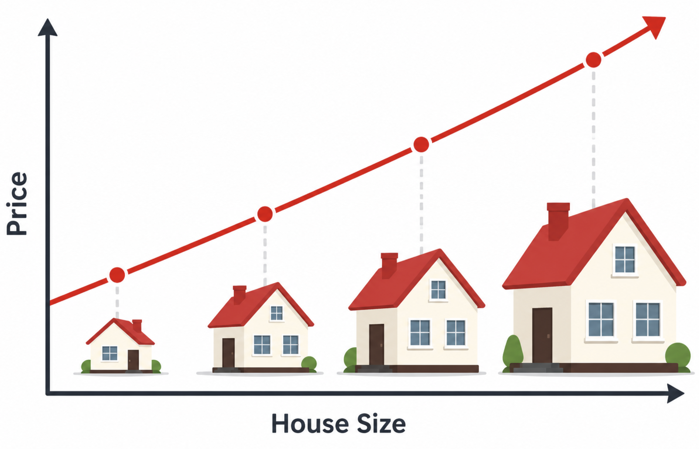
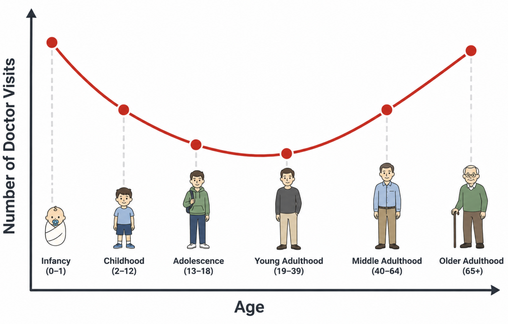

```{=html}
<style>#title-block-header { display: none; }</style>
<div class="lecture-header">
  <h1>Lecture 2: Multi-Layer Perceptrons &amp; Backpropagation</h1>
</div>
```

**Recap.** Recall from Lecture 1 that both linear regression and logistic regression are considered linear models. In this lecture, we study: What does it mean for a model to be linear, precisely? What are the limitations of linear models? what kinds of relationships can they not capture? How can we overcome these limitations, and how do we train the resulting model?

## Limitations of Linear Models

::: {.definition-block}
**Definition.** A model $\hat{y} = wx + b$ is a *linear model* if an increase
or decrease in any feature must **always** increase or decrease the output by
the same proportional amount, regardless of the current value of $x$.
:::

More precisely, two properties hold simultaneously:

1. **Monotonicity.** If $w > 0$, then $x \uparrow \Rightarrow \hat{y} \uparrow$
   *always* (and vice versa for $w < 0$). The direction never flips.
2. **Constant effect.** The rate of change $\dfrac{\partial\hat{y}}{\partial x} = w$ is
   the same everywhere. Graphically, $\hat{y}$ vs $x$ is a straight line.

### When linearity fails

Some relationships are approximately linear. For instance, larger houses tend to cost more, and a straight line is a reasonable first approximation. But many relationships are not. Consider doctor visits vs. age: visits are very frequent in infancy, drop through young adulthood, then climb again in old age. This U-shaped curve is neither monotonic nor linear.

::: {layout-ncol=2}



:::

A classic ML solution is hand-engineering: take $\log x$ to linearize an
exponential relationship. In deep learning we reject that. We learn the
features automatically.

---

## The Multi-Layer Perceptron {#sec-mlp}

The central idea in deep learning: build complex models by **composing many
simple, differentiable functions**.

### Why stacking linear layers doesn't help

Try composing two linear layers:

$$H = XW_1, \qquad O = HW_2$$

Substituting: $O = X\underbrace{W_1 W_2}_{=:\,W}$. The product of two matrices
is a matrix, so $O = XW$ is still a single linear layer.

::: {.callout-warning}
**Key fact.** Composing linear (affine) transformations always yields another
linear transformation. No matter how many linear layers you stack, the
composition is equivalent to a single affine map. Depth adds no expressive
power without nonlinearity.
:::

### Adding nonlinearity

The fix: insert a **nonlinear function** $\sigma$  (the *activation function* or
*nonlinearity*) between the linear layers:

$$\boxed{H = \sigma(XW_1 + b_1), \qquad O = HW_2 + b_2}$$

Because $\sigma$ is nonlinear, $O$ is now a **nonlinear** function of $X$.

**Element-wise application.** Inside neural networks $\sigma$ is
applied *element-wise*:

$$h_i = \sigma(x_i)$$

Each output element depends on exactly one input element ($\sigma$ is a scalar
function of a scalar) replicated independently at every position. This is in
contrast to softmax (from Lecture 1), where every output depends on all inputs.

### Architecture and Terminology

```{=html}
<div style="overflow-x:auto; margin:1.5rem 0;">
<svg viewBox="0 0 600 260" width="100%" style="max-width:600px; display:block; margin:auto;">
  <!-- Connections: input -> hidden -->
  <g stroke="#c5cae9" stroke-width="0.8" opacity="0.7">
    <!-- x1 -> h1..h4 -->
    <line x1="80" y1="50"  x2="270" y2="40"/><line x1="80" y1="50"  x2="270" y2="95"/>
    <line x1="80" y1="50"  x2="270" y2="150"/><line x1="80" y1="50"  x2="270" y2="205"/>
    <!-- x2 -> h1..h4 -->
    <line x1="80" y1="130" x2="270" y2="40"/><line x1="80" y1="130" x2="270" y2="95"/>
    <line x1="80" y1="130" x2="270" y2="150"/><line x1="80" y1="130" x2="270" y2="205"/>
    <!-- x3 -> h1..h4 -->
    <line x1="80" y1="210" x2="270" y2="40"/><line x1="80" y1="210" x2="270" y2="95"/>
    <line x1="80" y1="210" x2="270" y2="150"/><line x1="80" y1="210" x2="270" y2="205"/>
  </g>
  <!-- Connections: hidden -> output -->
  <g stroke="#a5d6a7" stroke-width="0.8" opacity="0.7">
    <line x1="310" y1="40"  x2="490" y2="95"/><line x1="310" y1="40"  x2="490" y2="165"/>
    <line x1="310" y1="95"  x2="490" y2="95"/><line x1="310" y1="95"  x2="490" y2="165"/>
    <line x1="310" y1="150" x2="490" y2="95"/><line x1="310" y1="150" x2="490" y2="165"/>
    <line x1="310" y1="205" x2="490" y2="95"/><line x1="310" y1="205" x2="490" y2="165"/>
  </g>
  <!-- Input nodes -->
  <g fill="#e8eaf6" stroke="#5c6bc0" stroke-width="1.5">
    <circle cx="80" cy="50"  r="22"/><circle cx="80" cy="130" r="22"/><circle cx="80" cy="210" r="22"/>
  </g>
  <g font-size="13" text-anchor="middle" fill="#3b4080" font-family="Inter,sans-serif">
    <text x="80" y="54">x₁</text><text x="80" y="134">x₂</text><text x="80" y="214">x₃</text>
  </g>
  <!-- Hidden nodes -->
  <g fill="#e8f5e9" stroke="#66bb6a" stroke-width="1.5">
    <circle cx="290" cy="40"  r="22"/><circle cx="290" cy="95"  r="22"/>
    <circle cx="290" cy="150" r="22"/><circle cx="290" cy="205" r="22"/>
  </g>
  <g font-size="11" text-anchor="middle" fill="#2e7d32" font-family="Inter,sans-serif">
    <text x="290" y="44">h₁</text><text x="290" y="99">h₂</text>
    <text x="290" y="154">h₃</text><text x="290" y="209">h₄</text>
  </g>
  <!-- Output nodes -->
  <g fill="#fff3e0" stroke="#ffa726" stroke-width="1.5">
    <circle cx="510" cy="95"  r="22"/><circle cx="510" cy="165" r="22"/>
  </g>
  <g font-size="12" text-anchor="middle" fill="#e65100" font-family="Inter,sans-serif">
    <text x="510" y="99">o₁</text><text x="510" y="169">o₂</text>
  </g>
  <!-- Labels -->
  <g font-size="11" text-anchor="middle" fill="#888" font-family="Inter,sans-serif">
    <text x="80"  y="245">Input x ∈ ℝ³</text>
    <text x="290" y="245">H = σ(XW₁+b₁)</text>
    <text x="510" y="245">O = HW₂+b₂</text>
  </g>
  <!-- Layer labels -->
  <g font-size="10" text-anchor="middle" fill="#5c6bc0" font-weight="600" font-family="Inter,sans-serif">
    <text x="80"  y="18">Layer 0</text>
    <text x="290" y="10">Layer 1 (hidden)</text>
    <text x="510" y="18">Layer 2 (output)</text>
  </g>
  <!-- Annotation: σ applied at hidden -->
  <rect x="141" y="116" width="88" height="15" fill="white" opacity="0.85"/>
  <text x="185" y="127" font-size="10" fill="#2e7d32" font-family="Inter,sans-serif" font-style="italic" text-anchor="middle">W₁, b₁ then σ</text>
  <rect x="363" y="116" width="74" height="15" fill="white" opacity="0.85"/>
  <text x="400" y="127" font-size="10" fill="#e65100" font-family="Inter,sans-serif" font-style="italic" text-anchor="middle">W₂, b₂</text>
</svg>
</div>
```

The architecture above is a **two-layer fully-connected multi-layer perceptron (MLP)**. Every input is
connected to every hidden unit, and every hidden unit to every output, hence
*fully connected*. The names for this architecture:

| Name | Notes |
|---|---|
| Multi-layer perceptron (MLP) | Historical; from the Perceptron [@rosenblatt1958perceptron] |
| Feed-forward (neural) network | Preferred modern term |
| Fully connected network | Emphasises all-to-all connectivity |
| Dense layer / dense network | Common in Keras / TensorFlow |

---

## Activation Functions {#sec-activations}

What should $\sigma$ be? A good activation function is **nonlinear** and **differentiable almost everywhere**, both properties required for gradient-based training. Here are the three canonical choices. Use the interactive explorer below to compare them.

```{=html}
<div class="interactive-widget">
<div class="widget-title">Activation Function Explorer</div>
```

```{ojs}
//| echo: false

// ── Controls ─────────────────────────────────────────────────────────────────
viewof selectedFns = Inputs.checkbox(
  new Map([["Sigmoid", "sigmoid"], ["ReLU", "relu"], ["Tanh", "tanh"]]),
  { value: ["sigmoid"], label: "Show functions:" }
)

viewof showDeriv = Inputs.toggle({ label: "Overlay derivatives (dashed)", value: false })

// ── Function definitions ──────────────────────────────────────────────────────
fnDefs = ({
  sigmoid: {
    f:  x => 1 / (1 + Math.exp(-x)),
    df: x => { const s = 1 / (1 + Math.exp(-x)); return s * (1 - s); },
    color: "#5c6bc0", label: "sigmoid(x)"
  },
  relu: {
    f:  x => Math.max(0, x),
    df: x => x >= 0 ? 1 : 0,
    color: "#e53935", label: "ReLU(x)"
  },
  tanh: {
    f:  x => Math.tanh(x),
    df: x => 1 - Math.tanh(x) ** 2,
    color: "#2e7d32", label: "tanh(x)"
  }
})

xs = Array.from({ length: 400 }, (_, i) => -6 + i * (12 / 399))

// ── Build marks ───────────────────────────────────────────────────────────────
activationMarks = selectedFns.flatMap(fn => {
  const { f, df, color, label } = fnDefs[fn]
  const main = Plot.line(
    xs.map(x => ({ x, y: f(x) })),
    { x: "x", y: "y", stroke: color, strokeWidth: 2.5 }
  )
  if (!showDeriv) return [main]
  const deriv = Plot.line(
    xs.map(x => ({ x, y: df(x) })),
    { x: "x", y: "y", stroke: color, strokeWidth: 1.8,
      strokeDasharray: "5,3", opacity: 0.65 }
  )
  return [main, deriv]
})

// ── Legend HTML ───────────────────────────────────────────────────────────────
legendHTML = html`<div style="display:flex;gap:1.2rem;flex-wrap:wrap;margin-bottom:0.5rem;font-size:0.82rem;">
  ${selectedFns.map(fn => {
    const {color, label} = fnDefs[fn]
    return html`<span>
      <svg width="28" height="10"><line x1="0" y1="5" x2="28" y2="5" stroke="${color}" stroke-width="2.5"/></svg>
      ${label}
      ${showDeriv ? html`&nbsp;<svg width="28" height="10"><line x1="0" y1="5" x2="28" y2="5" stroke="${color}" stroke-width="1.8" stroke-dasharray="4,2" opacity="0.7"/></svg> d/dx` : ""}
    </span>`
  })}
</div>`

// ── Plot ─────────────────────────────────────────────────────────────────────
activationPlot = Plot.plot({
  width: 580,
  height: 300,
  marginLeft: 60,
  marginBottom: 50,
  style: { fontSize: "14px" },
  x: { label: "x", domain: [-6, 6], grid: true, labelAnchor: "center", labelArrow: "none", labelOffset: 36 },
  y: { label: "y", domain: [-1.3, 1.3], grid: true, labelAnchor: "center", labelArrow: "none", labelOffset: 50 },
  marks: [
    Plot.ruleY([0], { stroke: "#ccc", strokeWidth: 1 }),
    Plot.ruleX([0], { stroke: "#ccc", strokeWidth: 1 }),
    ...activationMarks
  ]
})

html`${legendHTML}${activationPlot}`
```

```{=html}
</div>
```

### Sigmoid

$$\operatorname{sigmoid}(x) = \frac{1}{1 + e^{-x}}$$

**Properties:** output range $(0,1)$; $\operatorname{sigmoid}(0) = \tfrac{1}{2}$;
saturates to 0 and 1 at the extremes.

**Derivative** (enable "overlay derivatives" above to see it):

$$\frac{d}{dx}\operatorname{sigmoid}(x) = \operatorname{sigmoid}(x)\,\bigl(1 - \operatorname{sigmoid}(x)\bigr)$$

The derivative peaks at $\frac{1}{4}$ (at $x=0$) and **decays to zero** in
both directions. Select "Sigmoid" and toggle derivatives above to see this.

::: {.callout-warning}
**Vanishing gradients (preview).** When sigmoid saturates ($|x| \gg 0$), its
derivative is near zero. In a deep network, backpropagation multiplies many
such near-zero terms together, causing gradients to vanish exponentially toward
the early layers. This made deep sigmoid networks difficult to train, and is a
key reason ReLU gained dominance.
:::

### ReLU (Rectified Linear Unit)

$$\operatorname{ReLU}(x) = \max(0,\, x) = \begin{cases} 0 & x < 0 \\ x & x \geq 0 \end{cases}$$

**Derivative** (the Heaviside step function):

$$\frac{d}{dx}\operatorname{ReLU}(x) = \begin{cases} 0 & x < 0 \\ 1 & x \geq 0 \end{cases}$$

At $x=0$, ReLU is not classically differentiable; by convention the
subgradient is set to 1 there.

**Why ReLU dominates modern practice:**

- For $x > 0$, the gradient is exactly **1**; it never vanishes.
- Extremely cheap to compute and differentiate.
- The adoption of ReLU (and related functions) is credited as one of the key
  reasons for the deep learning resurgence around 2010–2012 (e.g. the AlexNet/ImageNet breakthrough [@krizhevsky2012imagenet]).

### Tanh

$$\tanh(x) = 2\,\operatorname{sigmoid}(2x) - 1$$

Tanh is a rescaled, shifted sigmoid: it ranges from $-1$ to $+1$ and is
*zero-centred* (unlike sigmoid's $(0,1)$ range). Historically favoured over
sigmoid for that reason, but modern practice almost universally uses ReLU or
its variants (Leaky ReLU, GELU, SiLU, etc.).

---

## Backpropagation {#sec-backprop}

Let $C$ denote the **cost (or loss) function**, a scalar that measures the discrepancy between the model's predictions and the true targets. Training proceeds by minimizing $C$ using gradient descent, which requires computing the gradient of the loss with respect to every parameter in the model, i.e., $\dfrac{\partial C}{\partial W^m}$ for each weight matrix $W^m$.

**Backpropagation** provides an algorithm for evaluating all such gradients by systematically applying the chain rule of calculus from the output layer back to the input layer. It can achieve more efficiency by reusing intermediate quantities computed during the forward pass, avoiding redundant calculations and enabling gradient computation in time proportional to a single forward evaluation.

### The Chain Rule — Two Cases

**Case 1: single intermediate variable.** If $C = C(z(w))$:

$$\frac{dC}{dw} = \frac{dC}{dz}\,\frac{dz}{dw}$$

**Case 2: multiple intermediate variables.** If $C$ reaches $w$ through
$z_1(w), z_2(w), \ldots, z_N(w)$ independently, i.e. $C = C(z_1(w), z_2(w), \ldots, z_N(w))$:

$$\frac{dC}{dw} = \sum_{i=1}^{N} \frac{\partial C}{\partial z_i}\,\frac{dz_i}{dw}$$

Think of it as: sum the derivative contribution along *every path* from $w$ to
$C$. Both cases come up repeatedly in the backprop derivation.

### Notation and Definitions

For an $L$-layer MLP:

| Symbol | Meaning | Shape |
|---|---|---|
| $L$ | Number of layers | scalar (integer) |
| $N^m$ | Width (# units) of layer $m$ | scalar (integer) |
| $W^m$ | Weight matrix for layer $m$ | $\mathbb{R}^{N^m \times N^{m-1}}$ |
| $b^m$ | Bias vector for layer $m$ | $\mathbb{R}^{N^m}$ |
| $\sigma^m$ | Nonlinearity at layer $m$ | $\mathbb{R}^{N^m} \to \mathbb{R}^{N^m}$ (element-wise) |
| $z^m$ | Pre-activations for layer $m$ | $\mathbb{R}^{N^m}$ |
| $a^m$ | Activations for layer $m$ | $\mathbb{R}^{N^m}$ |
| $a^0$ | Model input $\mathbf{x}$ | $\mathbb{R}^{N^0}$ |
| $y$ | Target output | $\mathbb{R}^{N^L}$ |
| $C$ | Cost / loss: $C(a^L,\, y) \in \mathbb{R}$ | scalar (real number) |

The **forward pass** computes, for $m = 1, \ldots, L$:

$$z^m = W^m a^{m-1} + b^m \qquad (\text{pre-activations})$$
$$a^m = \sigma^m(z^m) \qquad (\text{activations})$$

Backprop requires two quantities **pre-specified** from the model design:

- $\frac{\partial C}{\partial a^L}$: derivative of the loss w.r.t. the model output (e.g. cross-entropy gradient).
- $\frac{da^m}{dz^m} = (\sigma^m)'(z^m)$: derivative of the nonlinearity (sigmoid, ReLU, etc.), computed in @sec-activations.

### Deriving the Weight Gradient

We want $\frac{\partial C}{\partial W^m_{ij}}$ for any entry $(i,j)$, where $i \in \{1,\ldots,N^m\}$ indexes the unit in layer $m$ (row) and $j \in \{1,\ldots,N^{m-1}\}$ indexes the unit in layer $m-1$ (column). In other words, $W^m_{ij}$ is the weight of the connection from unit $j$ in layer $m-1$ to unit $i$ in layer $m$.

**Step 1 — Apply the chain rule, pivoting through $z^m$.**

$$\frac{\partial C}{\partial W^m_{ij}} = \sum_{k=1}^{N^m} \frac{\partial C}{\partial z^m_k} \frac{\partial z^m_k}{\partial W^m_{ij}}$$

**Step 2 — Evaluate $\partial z^m_k / \partial W^m_{ij}$.**

Expanding $z^m_k$ explicitly: $z^m_k = \sum_{\ell=1}^{N^{m-1}} W^m_{k\ell}\,a^{m-1}_\ell + b^m_k$.

The weight $W^m_{ij}$ appears *only* in the formula for $z^m_i$ (the $i$-th
row). Therefore:

$$\frac{\partial z^m_k}{\partial W^m_{ij}} = \begin{cases} a^{m-1}_j & k = i \\ 0 & k \neq i \end{cases}$$

**Step 3 — Collapse the sum.** All terms except $k=i$ are zero:

$$\frac{\partial C}{\partial W^m_{ij}} = \frac{\partial C}{\partial z^m_i} \cdot a^{m-1}_j$$

**Step 4 — Matrix form.** The vector $\frac{\partial C}{\partial z^m}$ has
shape $N^m$ and $a^{m-1}$ has shape $N^{m-1}$. Their outer product gives the
gradient matrix of shape $N^m \times N^{m-1}$, matching $W^m$:

::: {.boxed-eq}
$$\frac{\partial C}{\partial W^m} = \frac{\partial C}{\partial z^m} \cdot (a^{m-1})^\top$$
:::

### The Backward Recursion

We still need $\frac{\partial C}{\partial z^m}$. This is where the "back" in
backprop comes from.

**Base case ($m = L$):**

$$\frac{\partial C}{\partial z^L} = \frac{\partial C}{\partial a^L} \odot \frac{da^L}{dz^L}$$

Both factors are pre-specified. $\odot$ is element-wise (Hadamard) multiplication.

**Recursive case ($m < L$):** Expanding via the chain rule, pivoting through
the *next* layer's pre-activations $z^{m+1}$:

$$\frac{\partial C}{\partial z^m_k} = \left(\sum_{\ell=1}^{N^{m+1}} \frac{\partial C}{\partial z^{m+1}_\ell} \cdot W^{m+1}_{\ell k}\right) \cdot \frac{da^m_k}{dz^m_k}$$

In matrix form:

::: {.boxed-eq}
$$\frac{\partial C}{\partial z^m} = \left({W^{m+1}}^\top \frac{\partial C}{\partial z^{m+1}}\right) \odot \frac{da^m}{dz^m}$$
:::

**The key observation**: $\frac{\partial C}{\partial z^m}$ depends on
$\frac{\partial C}{\partial z^{m+1}}$; the gradient one layer *forward*.
Starting from $m=L$ and going backwards, each step feeds the next. This is
*back*propagation.

### The Algorithm

As an example, the computation graphs below show data flow through a 2-layer MLP. **(a)** shows individual scalar units with all weight connections; **(b)** is the vectorized form. Nodes are variables; **red** = parameters; **blue** = intermediate computations; **green** = loss.

```{=html}
<div style="overflow-x:auto; margin:1.5rem 0;">
<svg viewBox="0 0 760 210" width="100%" style="max-width:760px; display:block; margin:auto; font-family:serif;">
  <defs>
    <marker id="cgab-arr" markerWidth="6" markerHeight="5" refX="6" refY="2.5" orient="auto">
      <polygon points="0 0, 6 2.5, 0 5" fill="#333"/>
    </marker>
    <marker id="cgab-arr-r" markerWidth="6" markerHeight="5" refX="6" refY="2.5" orient="auto">
      <polygon points="0 0, 6 2.5, 0 5" fill="#c62828"/>
    </marker>
  </defs>

  <!-- ======== PART (a): Full scalar computation graph ======== -->

  <!-- Input nodes a₁⁽⁰⁾, a₂⁽⁰⁾ (black, bold) -->
  <text x="38"  y="74"  text-anchor="middle" font-size="14" font-weight="700" fill="#1a1a1a">a₁<tspan font-size="9" dy="-5">(0)</tspan></text>
  <text x="38"  y="124" text-anchor="middle" font-size="14" font-weight="700" fill="#1a1a1a">a₂<tspan font-size="9" dy="-5">(0)</tspan></text>

  <!-- Layer-1 pre-activations z₁, z₂ (blue) -->
  <text x="142" y="74"  text-anchor="middle" font-size="17" fill="#1565c0">z₁</text>
  <text x="142" y="124" text-anchor="middle" font-size="17" fill="#1565c0">z₂</text>

  <!-- Layer-1 activations a₁⁽¹⁾, a₂⁽¹⁾ (blue) -->
  <text x="218" y="74"  text-anchor="middle" font-size="14" fill="#1565c0">a₁<tspan font-size="9" dy="-5">(1)</tspan></text>
  <text x="218" y="124" text-anchor="middle" font-size="14" fill="#1565c0">a₂<tspan font-size="9" dy="-5">(1)</tspan></text>

  <!-- Layer-2 activations a₁⁽²⁾, a₂⁽²⁾ (blue) -->
  <text x="298" y="74"  text-anchor="middle" font-size="14" fill="#1565c0">a₁<tspan font-size="9" dy="-5">(2)</tspan></text>
  <text x="298" y="124" text-anchor="middle" font-size="14" fill="#1565c0">a₂<tspan font-size="9" dy="-5">(2)</tspan></text>

  <!-- Loss C (green) -->
  <text x="362" y="101" text-anchor="middle" font-size="22" fill="#1b5e20" font-style="italic">C</text>

  <!-- Targets t₁, t₂ (black) -->
  <text x="370" y="42"  text-anchor="middle" font-size="16" font-weight="600" fill="#1a1a1a">t₁</text>
  <text x="370" y="153" text-anchor="middle" font-size="16" font-weight="600" fill="#1a1a1a">t₂</text>

  <!-- x to z connections (all-to-all) -->
  <line x1="50" y1="68"  x2="130" y2="68"  stroke="#555" stroke-width="1.3" marker-end="url(#cgab-arr)"/>
  <line x1="50" y1="70"  x2="130" y2="118" stroke="#555" stroke-width="1.3" marker-end="url(#cgab-arr)"/>
  <line x1="50" y1="118" x2="130" y2="72"  stroke="#555" stroke-width="1.3" marker-end="url(#cgab-arr)"/>
  <line x1="50" y1="122" x2="130" y2="122" stroke="#555" stroke-width="1.3" marker-end="url(#cgab-arr)"/>

  <!-- z to h (σ applied element-wise) -->
  <line x1="154" y1="68"  x2="206" y2="68"  stroke="#555" stroke-width="1.3" marker-end="url(#cgab-arr)"/>
  <line x1="154" y1="122" x2="206" y2="122" stroke="#555" stroke-width="1.3" marker-end="url(#cgab-arr)"/>

  <!-- h to y connections (all-to-all) -->
  <line x1="230" y1="68"  x2="284" y2="68"  stroke="#555" stroke-width="1.3" marker-end="url(#cgab-arr)"/>
  <line x1="230" y1="70"  x2="284" y2="118" stroke="#555" stroke-width="1.3" marker-end="url(#cgab-arr)"/>
  <line x1="230" y1="118" x2="284" y2="72"  stroke="#555" stroke-width="1.3" marker-end="url(#cgab-arr)"/>
  <line x1="230" y1="122" x2="284" y2="122" stroke="#555" stroke-width="1.3" marker-end="url(#cgab-arr)"/>

  <!-- y to C -->
  <line x1="308" y1="66"  x2="350" y2="87"  stroke="#555" stroke-width="1.3" marker-end="url(#cgab-arr)"/>
  <line x1="308" y1="122" x2="350" y2="104" stroke="#555" stroke-width="1.3" marker-end="url(#cgab-arr)"/>

  <!-- t to C -->
  <line x1="370" y1="46"  x2="367" y2="84"  stroke="#555" stroke-width="1.3" marker-end="url(#cgab-arr)"/>
  <line x1="370" y1="149" x2="367" y2="112" stroke="#555" stroke-width="1.3" marker-end="url(#cgab-arr)"/>

  <!-- Layer-1 weight labels (red) — upper: w₁₁⁽¹⁾, w₁₂⁽¹⁾, b₁⁽¹⁾ entering z₁ -->
  <text x="75"  y="17" text-anchor="middle" font-size="10" fill="#c62828">w₁₁⁽¹⁾</text>
  <line x1="81"  y1="20" x2="133" y2="61" stroke="#c62828" stroke-width="1.1" marker-end="url(#cgab-arr-r)"/>
  <text x="108" y="17" text-anchor="middle" font-size="10" fill="#c62828">w₁₂⁽¹⁾</text>
  <line x1="114" y1="20" x2="135" y2="63" stroke="#c62828" stroke-width="1.1" marker-end="url(#cgab-arr-r)"/>
  <text x="150" y="17" text-anchor="middle" font-size="10" fill="#c62828">b₁⁽¹⁾</text>
  <line x1="150" y1="20" x2="143" y2="62" stroke="#c62828" stroke-width="1.1" marker-end="url(#cgab-arr-r)"/>

  <!-- Layer-1 weight labels (red) — lower: w₂₁⁽¹⁾, w₂₂⁽¹⁾, b₂⁽¹⁾ entering z₂ (centred below z₂ to avoid crossing main arrows) -->
  <text x="100" y="195" text-anchor="middle" font-size="10" fill="#c62828">w₂₁⁽¹⁾</text>
  <line x1="104" y1="190" x2="133" y2="128" stroke="#c62828" stroke-width="1.1" marker-end="url(#cgab-arr-r)"/>
  <text x="140" y="195" text-anchor="middle" font-size="10" fill="#c62828">w₂₂⁽¹⁾</text>
  <line x1="140" y1="190" x2="139" y2="129" stroke="#c62828" stroke-width="1.1" marker-end="url(#cgab-arr-r)"/>
  <text x="175" y="195" text-anchor="middle" font-size="10" fill="#c62828">b₂⁽¹⁾</text>
  <line x1="172" y1="190" x2="147" y2="129" stroke="#c62828" stroke-width="1.1" marker-end="url(#cgab-arr-r)"/>

  <!-- Layer-2 weight labels (red) — upper: w₁₁⁽²⁾, w₁₂⁽²⁾, b₁⁽²⁾ entering y₁ -->
  <text x="246" y="17" text-anchor="middle" font-size="10" fill="#c62828">w₁₁⁽²⁾</text>
  <line x1="252" y1="20" x2="288" y2="61" stroke="#c62828" stroke-width="1.1" marker-end="url(#cgab-arr-r)"/>
  <text x="276" y="17" text-anchor="middle" font-size="10" fill="#c62828">w₁₂⁽²⁾</text>
  <line x1="281" y1="20" x2="291" y2="63" stroke="#c62828" stroke-width="1.1" marker-end="url(#cgab-arr-r)"/>
  <text x="308" y="17" text-anchor="middle" font-size="10" fill="#c62828">b₁⁽²⁾</text>
  <line x1="308" y1="20" x2="300" y2="62" stroke="#c62828" stroke-width="1.1" marker-end="url(#cgab-arr-r)"/>

  <!-- Layer-2 weight labels (red) — lower: w₂₁⁽²⁾, w₂₂⁽²⁾, b₂⁽²⁾ entering y₂ (centred below y₂ to avoid crossing main arrows) -->
  <text x="258" y="195" text-anchor="middle" font-size="10" fill="#c62828">w₂₁⁽²⁾</text>
  <line x1="262" y1="190" x2="288" y2="128" stroke="#c62828" stroke-width="1.1" marker-end="url(#cgab-arr-r)"/>
  <text x="296" y="195" text-anchor="middle" font-size="10" fill="#c62828">w₂₂⁽²⁾</text>
  <line x1="296" y1="190" x2="295" y2="129" stroke="#c62828" stroke-width="1.1" marker-end="url(#cgab-arr-r)"/>
  <text x="333" y="195" text-anchor="middle" font-size="10" fill="#c62828">b₂⁽²⁾</text>
  <line x1="330" y1="190" x2="304" y2="129" stroke="#c62828" stroke-width="1.1" marker-end="url(#cgab-arr-r)"/>

  <!-- (a) label -->
  <text x="185" y="207" text-anchor="middle" font-size="13" fill="#555">(a)</text>

  <!-- Divider between (a) and (b) -->
  <line x1="385" y1="5" x2="385" y2="198" stroke="#d0d0d0" stroke-width="1" stroke-dasharray="4,3"/>

  <!-- ======== PART (b): Vectorized computation graph ======== -->

  <!-- Main chain arrows -->
  <line x1="416" y1="88" x2="470" y2="88" stroke="#333" stroke-width="1.5" marker-end="url(#cgab-arr)"/>
  <line x1="495" y1="88" x2="535" y2="88" stroke="#333" stroke-width="1.5" marker-end="url(#cgab-arr)"/>
  <line x1="558" y1="88" x2="597" y2="88" stroke="#333" stroke-width="1.5" marker-end="url(#cgab-arr)"/>
  <line x1="620" y1="88" x2="652" y2="88" stroke="#333" stroke-width="1.5" marker-end="url(#cgab-arr)"/>
  <line x1="672" y1="88" x2="704" y2="88" stroke="#333" stroke-width="1.5" marker-end="url(#cgab-arr)"/>

  <!-- Main chain nodes -->
  <text x="405" y="96" text-anchor="middle" font-size="16" font-weight="700" fill="#1a1a1a">a<tspan font-size="10" dy="-5">(0)</tspan></text>
  <text x="482" y="96" text-anchor="middle" font-size="18" fill="#1565c0">z<tspan font-size="11" dy="-5">(1)</tspan></text>
  <text x="547" y="96" text-anchor="middle" font-size="16" fill="#1565c0">a<tspan font-size="10" dy="-5">(1)</tspan></text>
  <text x="609" y="96" text-anchor="middle" font-size="18" fill="#1565c0">z<tspan font-size="11" dy="-5">(2)</tspan></text>
  <text x="662" y="96" text-anchor="middle" font-size="16" fill="#1565c0">a<tspan font-size="10" dy="-5">(2)</tspan></text>
  <text x="720" y="100" text-anchor="middle" font-size="24" fill="#1b5e20" font-style="italic">C</text>

  <!-- W⁽¹⁾ upper-left → z⁽¹⁾ -->
  <text x="452" y="44" text-anchor="middle" font-size="14" font-weight="700" fill="#c62828">W<tspan font-size="9" dy="-4">(1)</tspan></text>
  <line x1="464" y1="48" x2="473" y2="79" stroke="#c62828" stroke-width="1.4" marker-end="url(#cgab-arr-r)"/>

  <!-- b⁽¹⁾ lower-left → z⁽¹⁾ -->
  <text x="452" y="140" text-anchor="middle" font-size="14" font-weight="700" fill="#c62828">b<tspan font-size="9" dy="-4">(1)</tspan></text>
  <line x1="464" y1="134" x2="473" y2="97" stroke="#c62828" stroke-width="1.4" marker-end="url(#cgab-arr-r)"/>

  <!-- W⁽²⁾ upper-left → z⁽²⁾ -->
  <text x="578" y="44" text-anchor="middle" font-size="14" font-weight="700" fill="#c62828">W<tspan font-size="9" dy="-4">(2)</tspan></text>
  <line x1="590" y1="48" x2="600" y2="79" stroke="#c62828" stroke-width="1.4" marker-end="url(#cgab-arr-r)"/>

  <!-- b⁽²⁾ lower-left → z⁽²⁾ -->
  <text x="578" y="140" text-anchor="middle" font-size="14" font-weight="700" fill="#c62828">b<tspan font-size="9" dy="-4">(2)</tspan></text>
  <line x1="590" y1="134" x2="600" y2="97" stroke="#c62828" stroke-width="1.4" marker-end="url(#cgab-arr-r)"/>

  <!-- t upper-right → C -->
  <text x="742" y="44" text-anchor="middle" font-size="18" font-weight="700" fill="#1a1a1a">t</text>
  <line x1="740" y1="50" x2="728" y2="80" stroke="#333" stroke-width="1.4" marker-end="url(#cgab-arr)"/>

  <!-- (b) label -->
  <text x="572" y="207" text-anchor="middle" font-size="13" fill="#555">(b)</text>
</svg>
</div>
```

Here $t$ denotes the **target** (ground truth label), which is the true output value the network should predict. The cost $C$ measures the discrepancy between the network's prediction $y$ and $t$.

Summarized as a clean algorithm:

::: {.algorithm}
#### Backpropagation Algorithm

**Pre-specify** (from model design):

- $\frac{\partial C}{\partial a^L}$ — loss gradient w.r.t. the model output.
- $\frac{da^m}{dz^m} = (\sigma^m)'(z^m)$ — nonlinearity derivative at each layer.

**Forward pass** — compute and *cache* all activations:
$$a^0 = \mathbf{x}, \quad z^m = W^m a^{m-1} + b^m, \quad a^m = \sigma^m(z^m), \quad m=1,\ldots,L$$

**Step 1 — Base case** (output layer):
$$\frac{\partial C}{\partial z^L} = \frac{\partial C}{\partial a^L} \odot \frac{da^L}{dz^L}$$

**Step 2 — Backward recursion** for $m = L-1, L-2, \ldots, 1$:
$$\frac{\partial C}{\partial z^m} = \underbrace{\left({W^{m+1}}^\top \frac{\partial C}{\partial z^{m+1}}\right)}_{\text{from prev step}} \odot \underbrace{\frac{da^m}{dz^m}}_{\text{known}}$$

**Step 3 — Weight gradients** for all $m$:
$$\frac{\partial C}{\partial W^m} = \underbrace{\frac{\partial C}{\partial z^m}}_{\text{step 2}} \cdot \underbrace{(a^{m-1})^\top}_{\text{forward pass}}$$

**Gradient descent update:**
$$W^m \leftarrow W^m - \eta\,\frac{\partial C}{\partial W^m}$$
:::

**Why is this efficient?** A single forward pass (caching all $a^m$) plus a
single backward pass gives **all** weight gradients simultaneously. Without
caching, computing the gradient for layer 1 would require re-running layers
$2,\ldots,L$ for every single weight, which is exponentially more expensive.

### Connecting Back to Vanishing Gradients

In the backward recursion, each step multiplies by $\frac{da^m}{dz^m}$.
For sigmoid, $\max_x \frac{d}{dx}\operatorname{sigmoid}(x) = \frac{1}{4}$.
In an $L$-layer sigmoid network, the gradient reaching layer 1 is scaled by
roughly $\left(\frac{1}{4}\right)^L$, vanishing rapidly.
For ReLU, the derivative in the active region is exactly 1 (no shrinkage).
Toggle the "Tanh/Sigmoid + overlay derivatives" in the explorer above to see
the saturation visually.

---

## Universal Approximation Theorem {#sec-uat}

::: {.theorem-block}
**Theorem (Universal Approximation, informal).** A sufficiently *wide* MLP with
a **single hidden layer** can approximate any continuous function on a compact
domain arbitrarily well.
*Width* = the number of hidden units $N^1$.
:::

### Visual Proof via Bump Functions

The following interactive demo lets you build a function approximation using
"bump functions".
Each pair of neurons produces one bump; together they tile the input space.

```{=html}
<div class="interactive-widget">
<div class="widget-title">Universal Approximation — Interactive Demo</div>
```

```{ojs}
//| echo: false

// ── Controls ──────────────────────────────────────────────────────────────────
viewof nBumps = Inputs.range([1, 30], {
  step: 1, value: 5,
  label: "Number of bumps (= neuron pairs)"
})

viewof targetChoice = Inputs.radio(
  new Map([
    ["Sine wave", "sine"],
    ["Sawtooth",  "sawtooth"],
    ["Bump",      "bump"],
    ["W-shape",   "w"]
  ]),
  { value: "sine", label: "Target function:" }
)

// ── Target functions ──────────────────────────────────────────────────────────
targetFns = ({
  sine:     x => 1.4 * Math.sin(Math.PI * x) + 0.5 * Math.sin(3 * Math.PI * x) + 1.2,
  sawtooth: x => 2 * (x - Math.floor(x + 0.5)) + 1.0,
  bump:     x => 2.0 * Math.exp(-((x - 0.5)**2) / 0.04) + 0.1,
  w:        x => 1.5 * Math.abs(Math.sin(2 * Math.PI * x)) + 0.1
})

targetFn = targetFns[targetChoice]

// ── Bump approximation ────────────────────────────────────────────────────────
bumpHeight = i => targetFn((i + 0.5) / nBumps)

approxFn = x => {
  const i = Math.min(Math.floor(x * nBumps), nBumps - 1)
  return bumpHeight(i)
}

// ── MSE ───────────────────────────────────────────────────────────────────────
densePts = Array.from({ length: 500 }, (_, i) => i / 499)
mse = d3.mean(densePts.map(x => (targetFn(x) - approxFn(x)) ** 2))
rmse = Math.sqrt(mse)

// ── Plot ──────────────────────────────────────────────────────────────────────
uatPlot = {
  const xs = Array.from({ length: 600 }, (_, i) => i / 599)

  const targetLine = Plot.line(
    xs.map(x => ({ x, y: targetFn(x) })),
    { x: "x", y: "y", stroke: "#1a1a2e", strokeWidth: 2.5 }
  )

  const approxLine = Plot.line(
    xs.map(x => ({ x, y: approxFn(x) })),
    { x: "x", y: "y", stroke: "#5c6bc0", strokeWidth: 2, strokeDasharray: "6,3" }
  )

  const bumpRects = Array.from({ length: nBumps }, (_, i) => {
    const x0 = i / nBumps, x1 = (i + 1) / nBumps, h = bumpHeight(i)
    return Plot.rect(
      [{ x0, x1, h }],
      {
        x1: d => d.x0, x2: d => d.x1, y1: 0, y2: d => d.h,
        fill: "#7986cb", fillOpacity: 0.12,
        stroke: "#5c6bc0", strokeOpacity: 0.35, strokeWidth: 0.8
      }
    )
  })

  return Plot.plot({
    width: 580, height: 300,
    marginLeft: 45,
    x: { label: "x →", domain: [0, 1], grid: true },
    y: { label: "output →", domain: [0, 3.2], grid: true },
    marks: [
      Plot.ruleY([0], { stroke: "#eee" }),
      ...bumpRects,
      targetLine,
      approxLine
    ]
  })
}

// ── Metric display ────────────────────────────────────────────────────────────
metricDisplay = html`
<div style="display:flex; gap:1.5rem; margin-top:0.7rem; flex-wrap:wrap;">
  <div style="background:#f0f2ff; border-radius:8px; padding:0.5rem 1rem; font-size:0.85rem;">
    <strong style="color:#3b4080;">Neuron pairs:</strong> ${nBumps}
    &nbsp;→&nbsp; <strong>${2 * nBumps}</strong> hidden units
  </div>
  <div style="background:${rmse < 0.05 ? "#e8f5e9" : rmse < 0.15 ? "#fff3e0" : "#fce4ec"};
    border-radius:8px; padding:0.5rem 1rem; font-size:0.85rem;">
    <strong style="color:${rmse < 0.05 ? "#2e7d32" : rmse < 0.15 ? "#e65100" : "#c62828"}">
      RMSE: ${rmse.toFixed(4)}
    </strong>
    ${rmse < 0.05 ? " ✓ Excellent" : rmse < 0.15 ? " ⚠ Moderate" : " ✗ Poor"}
  </div>
</div>
<div style="font-size:0.78rem; color:#888; margin-top:0.5rem;">
  <span style="color:#1a1a2e; font-weight:500;">— target</span> &nbsp;
  <span style="color:#5c6bc0; font-weight:500;">- - approx</span> &nbsp;
  <span style="background:#7986cb; opacity:0.4; display:inline-block; width:12px; height:10px; border-radius:2px; vertical-align:middle;"></span> bump regions
</div>`

html`${uatPlot}${metricDisplay}`
```

```{=html}
</div>
```

**How it works:**

1. **One neuron → step function.** A single sigmoid unit $h = \sigma(wx+b)$
   transitions from 0 to 1 around the point where its input is zero:
   $$wx + b = 0 \;\Longrightarrow\; x = s := -\tfrac{b}{w}.$$
   As $w \to \infty$ the sigmoid sharpens into a Heaviside step: $h \approx
   \mathbf{1}[x \ge s]$. The step location $s = -b/w$ is controlled entirely
   by the bias-to-weight ratio.

2. **Two neurons → bump function.** Take two such step units with step
   locations $s_1 < s_2$ and attach output weights $+c$ and $-c$:
   $$\text{output} \approx c\,\mathbf{1}[x \ge s_1] - c\,\mathbf{1}[x \ge s_2]
   = c\,\mathbf{1}[s_1 \le x < s_2].$$
   This is a rectangular pulse (bump) of height $c$ supported on $[s_1, s_2)$.
   Setting $c$ to the desired function value at that interval and choosing
   $s_1, s_2$ to set its width gives full control over the bump.

3. **$K$ pairs → tile the domain.** Partition the input range into $K$ equal
   intervals. Place one bump per interval, setting its height to
   $f\!\left(\tfrac{i+0.5}{K}\right)$, which is the target value at the interval
   centre. The piecewise-constant approximation has error $O(1/K)$, so as
   $K \to \infty$ it converges uniformly to any continuous $f$.

Try increasing "Number of bumps" to see the approximation converge. Also try
switching to the "Sawtooth" or "W-shape" to see even discontinuous/jagged functions
can be approximated!

### Caveats: Is This Actually Useful?

::: {.callout-important}
The theorem sounds incredible, but it has three important limitations that
foreshadow most of what we'll learn this semester.
:::

| Caveat | What it means | Motivates |
|---|---|---|
| **It implies we can overfit** | We have training data, not the true function. A wide enough MLP can memorise every training point. | Regularisation (Lecture 3) |
| **The model may be enormous** | The number of bumps to tile a $d$-dimensional space grows exponentially in $d$. | Specialised architectures (i.g., CNNs, Transformers) |
| **It doesn't tell us how** | The constructive proof hand-picks weights. We can't do that at scale. | Gradient descent, backprop, adaptive optimizers |

---

## Summary {#sec-summary}

::: {.callout-note}
**Key takeaways from Lecture 2**

- **Linear models** cannot represent nonlinear relationships. Stacking affine
  layers collapses to a single affine map; depth buys nothing without
  nonlinearity.
- **Nonlinearity** (an element-wise activation function $\sigma$) injected
  between linear layers gives the MLP its expressive power.
- **Sigmoid** was the historical default; it suffers from vanishing gradients
  due to saturating derivatives. **ReLU** (gradient = 1 for $x>0$) avoids
  this and dominates modern practice.
- **Backpropagation** is a three-step algorithm: (1) base case at the output
  layer, (2) backward recursion using the weight transpose, (3) outer product
  to get weight gradients. The forward pass caches activations to avoid
  recomputation.
- The **Universal Approximation Theorem** guarantees a wide enough
  single-hidden-layer MLP can fit any function, but overfitting, model size,
  and the question of *how* to train are all open challenges.
:::

**Next lecture:** Regularization and Overfitting - how to prevent the MLP
from simply memorizing training data.

## References {#sec-references .unnumbered}

::: {#refs}
:::
